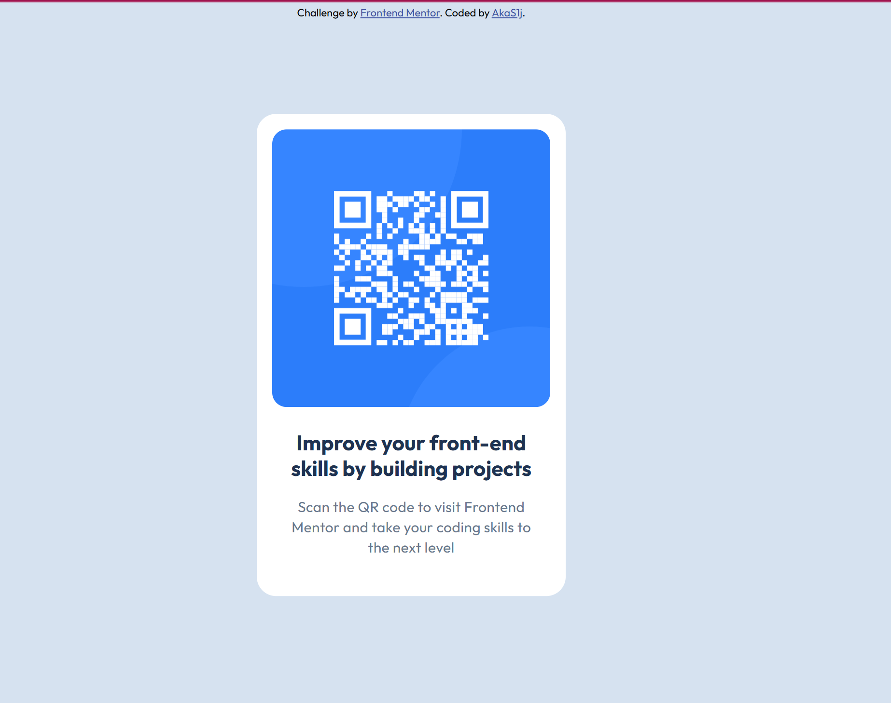

# Frontend Mentor - QR code component solution

This is my first project on Frontend Mentor.  
I repeated the basic principles of **HTML** and **CSS**, and tried to recall the main properties.  
It was a good practice to refresh my knowledge, and I will continue doing more challenges to improve my skills.

## Overview

### Screenshot

### Links
- Solution URL: [GitHub repo](https://github.com/akaC1J/frontend_mentor-qr_code_component)
- Live Site URL: [Live site on GitHub Pages](https://qr-code-component.vercel.app)

## My process

### Built with
- Semantic HTML5
- CSS custom properties
- Flexbox

### What I learned
I practiced basic layout skills and learned how to use `gap` instead of `margin`.  
I also tried the `aspect-ratio` property for images.

### Continued development
I want to continue practicing responsive design and improve my CSS skills step by step.

## Author
- Frontend Mentor – [@akaC1J](https://www.frontendmentor.io/profile/akaC1J)
- GitHub – [akaC1J](https://github.com/akaC1J)
